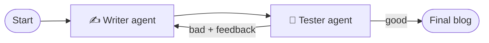

<div align="center">

# ✍️ Blog Generator

**A writer–reviewer LangGraph loop that drafts a blog post and keeps improving it until it passes review.**


</div>

---

## ✨ Overview

Give the app a topic and two agents collaborate:

- ✍️ **Writer agent** drafts the blog post (and revises it using feedback).
- 🧪 **Tester agent** grades the post as `good` or `bad` with structured output and explains what to improve.

If the post is rejected, the feedback goes back to the writer; once it is accepted, the final blog is shown.



The Streamlit sidebar displays the live workflow diagram.

## 🚀 Getting Started

### Prerequisites

- Python 3.10+
- [Ollama](https://ollama.com/) with the model pulled: `ollama pull llama3.2:1b`

### Install & run

```bash
git clone https://github.com/Arashomranpour/BlogGenerator.git
cd BlogGenerator
pip install -r requirements.txt
streamlit run app.py
```

Enter a topic, press **Run Workflow** and wait for the accepted blog post.

## 📁 Project Structure

```
.
├── app.py            # LangGraph workflow + Streamlit UI
├── requirements.txt
└── LICENSE
```

## 🛠️ Tech Stack

`LangGraph` · `LangChain` · `Ollama (llama3.2:1b)` · `Pydantic` · `Streamlit`

## 📄 License

Released under the [Apache 2.0 License](LICENSE).
